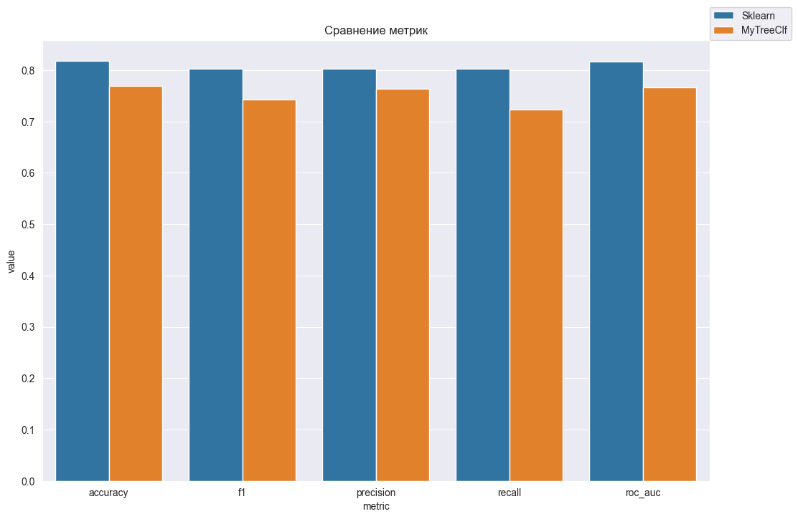
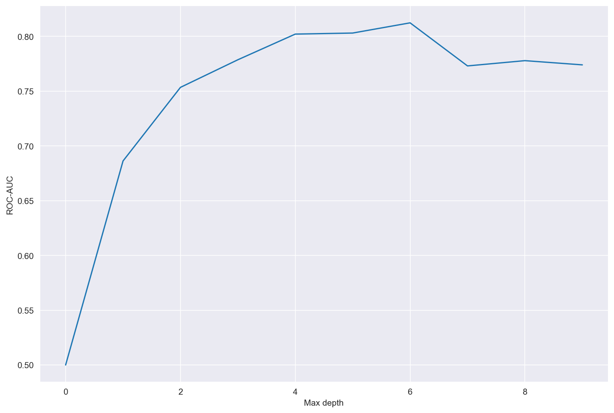
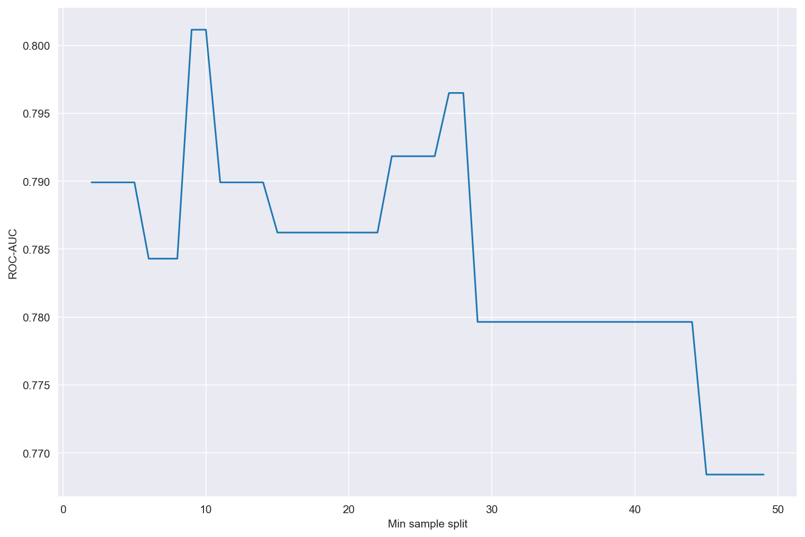
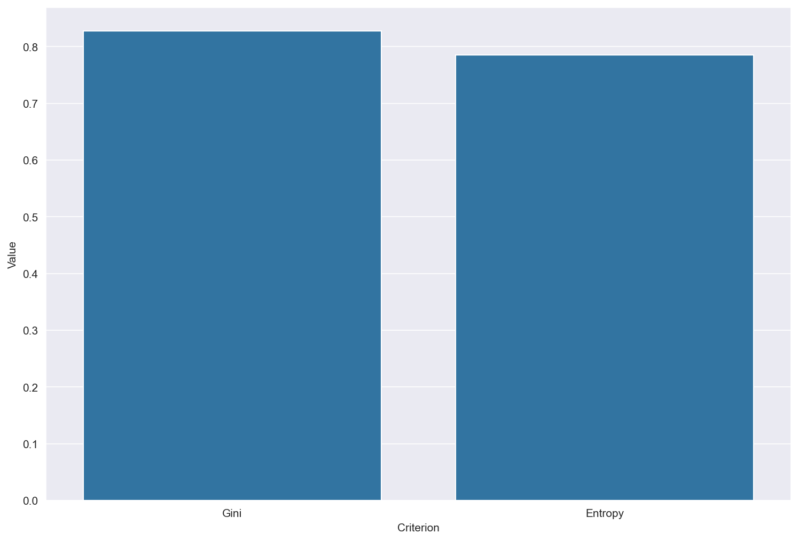

# Проект: Реализация дерева решений с нуля (MyTreeClf)

## Введение

Проект реализует **классификационное дерево решений (Decision Tree Classifier)** на Python без использования готовых библиотек машинного обучения.

Особенности реализации:

* Поддержка разных критериев разбиения: **энтропия (information gain), Gini**
* Ограничения глубины дерева, числа листьев и минимального числа объектов для разбиения
* Поддержка дискретизации признаков через **bins**
* Вычисление **важности признаков** на основе прироста критерия
* Простой и наглядный код для изучения работы дерева решений

**Цель проекта:** изучение принципов работы классификационных деревьев и их реализация с нуля.
**Актуальность:** деревья решений — базовый и легко интерпретируемый метод классификации, часто используемый для анализа данных и в ансамблевых алгоритмах.

---

## Теоретическая часть

### Модель дерева решений

Принцип работы алгоритма:

1. На каждом узле выбирается **лучший признак и точка разбиения**, максимизирующие прирост выбранного критерия (энтропия или Gini).
2. Объекты разделяются на две группы по условию `feature <= split_value`.
3. Рекурсивно строятся **левое и правое поддеревья** до достижения условий остановки:

   * максимальная глубина (`max_depth`)
   * минимальное число объектов для разбиения (`min_samples_split`)
   * максимальное число листьев (`max_leafs`)
4. Лист дерева хранит **вероятность положительного класса** (для бинарной классификации).

---

## Реализация (MyTreeClf)

Класс `MyTreeClf` поддерживает следующие параметры:

| Параметр            | Тип          | Описание                                           |
| ------------------- | ------------ | -------------------------------------------------- |
| max\_depth          | int          | Максимальная глубина дерева                        |
| min\_samples\_split | int          | Минимальное число объектов для разбиения узла      |
| max\_leafs          | int          | Максимальное число листьев                         |
| criterion           | str          | Критерий качества разбиения (`entropy` или `gini`) |
| bins                | int или None | Количество биннов для дискретизации признаков      |

---

## Критерии разбиения

| Критерий    | Формула                   | Особенности                                                                |
| ----------- | ------------------------- | -------------------------------------------------------------------------- |
| **entropy** | $-\sum_i p_i \log_2(p_i)$ | Измеряет неопределенность классов, подходит для несбалансированных выборок |
| **gini**    | $1 - \sum_i p_i^2$        | Менее чувствителен к малым классам, часто быстрее вычисляется              |

---

## Ограничения дерева

* **max\_depth** — предотвращает чрезмерное углубление дерева
* **min\_samples\_split** — предотвращает разбиение маленьких узлов
* **max\_leafs** — ограничивает количество листьев, контролируя размер дерева

---

## Важность признаков

Важность признака рассчитывается как **сумма приростов критерия** на всех разбиениях, где этот признак использовался:

* Признаки с большим приростом более значимы для модели
* Можно использовать для выбора ключевых признаков и отбора данных

---

## Предсказание

* `predict_proba(X)` — возвращает вероятность положительного класса для каждого объекта
* `predict(X)` — возвращает бинарный класс (`0` или `1`) на основе порога 0.5

---

## Сравнение собственной и встроенной реализаций

* **Максимальная глубина** — 5
* **Максимальное количество листьев** — 100
* **Критерий** — Gini

## Сравнение ROC-AUC по количеству листьев на собственной реализации

## Сравнение ROC-AUC по максимальной глубине на собственной реализации

## Сравнение ROC-AUC по количеству для разбиения на собственной реализации

## Сравнение ROC-AUC по Gini и Entropy

